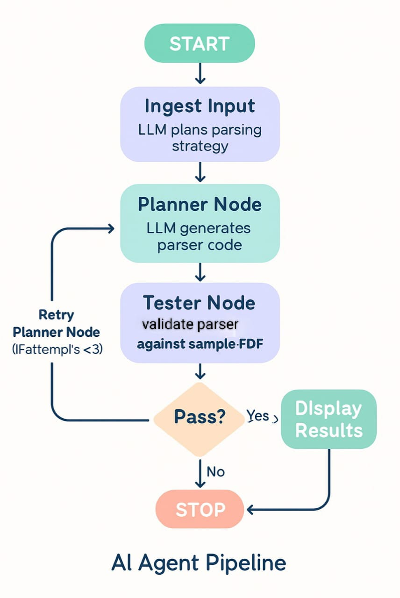

# ai-agent-challenge

This project implements an AI-powered agent that automatically generates custom parsers for bank statements in PDF format. The agent extracts and normalizes transaction data into a consistent schema and validates the results against ground-truth CSV files. The focus is on automation, adaptability, and test-driven reliability, ensuring the solution works seamlessly for different banks.


1. **Clone the repository**
   ```bash
   git clone github.com/apurv-korefi/ai-agent-challenge
   cd ai-agent-challenge
   ```

2. **Create and activate a virtual environment**
   ```bash
   python -m venv venv
   source venv/bin/activate   # Linux/Mac
   venv\Scripts\activate  # Windows
   ```

3. **Install dependencies**
   ```bash
   pip install -r requirements.txt
   ```

4. **Run the agent for a target bank (example: ICICI)**
   ```bash
   python agent.py --target icici
   ```

5. **Run the tests**
   ```bash
   python -m pytest -q
   ```

## Agent Loop Description


The agent works in a self-correcting loop:

1. Accepts the target bank name (e.g., ICICI).  

2. Generates a custom parser for the bank’s PDF statement. 

3. Extracts transactions and normalizes them into the schema:  
    Date | Description | Debit Amt | Credit Amt | Balance

4. Validates the parser output against the reference CSV using automated tests. 

5. If validation fails, the agent retries up to three times, refining the parser each time.  

6. Stops when the parser output matches exactly or when attempts are exhausted.  


[AI Agent Pipeline]




